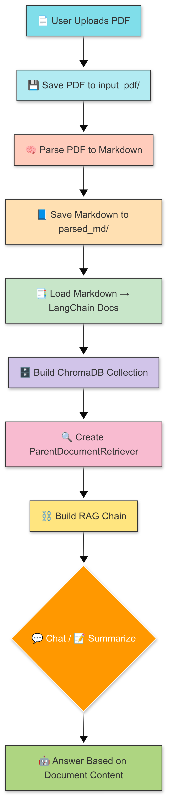
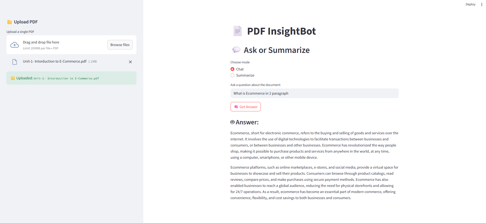
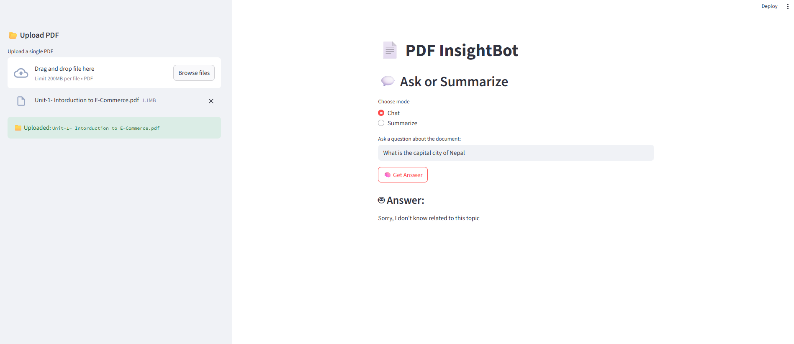
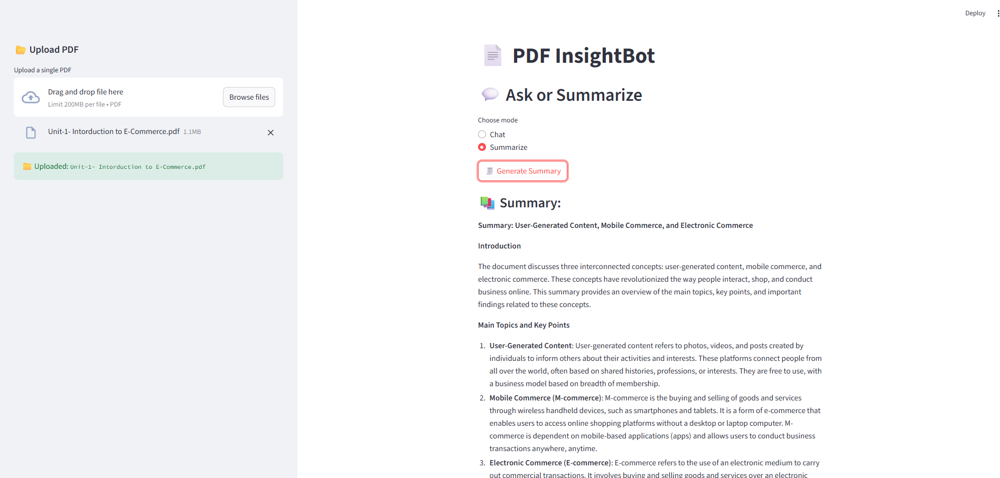

# PDF InsightBot – Chat & Summarize Your PDF

A **Streamlit-based RAG (Retrieval-Augmented Generation) chatbot** that lets you upload a PDF and ask questions or get summaries using **LlamaParse**, **LangChain**, **ChromaDB**, and **LLM models**.

Perfect for:

- Reading and understanding long documents
- Asking targeted questions about content
- Generating summaries without reading the whole thing

---

## 🔍 Features

✅ Upload and parse PDFs using **LlamaParse**  
✅ Store document content in **ChromaDB**  
✅ Use **Parent/Child retrieval** for better context  
✅ Ask questions or generate summaries with LLM  
✅ Works across single PDF uploads  
✅ Clean, responsive UI with Streamlit

---

## System FlowChart



# Screenshots





## 📁 Folder Structure

```
PDF-InsightBot/
│
├── app.py                  # Main Streamlit app
├── .env                    # Environment variables
├── requirements.txt        # Python dependencies
├── data/
│   ├── input_pdf/          # Uploaded PDF files
│   ├── parsed_md/          # Parsed Markdown files
│   └── chroma_db/          # ChromaDB vector store per PDF
│
├── parser/
│   └── pdf_parser.py       # Uses LlamaParse to extract Markdown
│
├── utils/
│   └── file_utils.py       # File handling utilities
│
└── chatbot/
    ├── text_splitter.py
    ├── vector_store.py
    ├── retriever.py
    ├── chain.py
    └── embedding.py
```

---

## 🚀 How to Run

### 1. Clone the repo

### 2. Install dependencies

```bash
pip install -r requirements.txt
```

### 3. Set up environment variables

Create a `.env` file:

```env
LLAMA_PARSE_API_KEY=your_llama_parse_api_key
GROQ_API_KEY=your_groq_api_key  # Optional: if using Groq LLM
```

### 4. Run the app

```bash
streamlit run app.py
```
